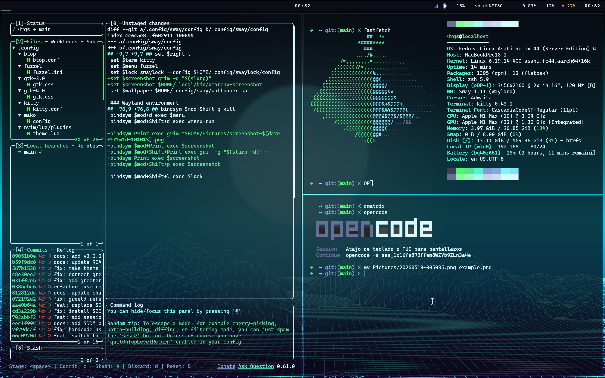

# Fedora Asahi Omarchy Themes



Configuración estilo Omarchy para Fedora Asahi + Sway. Sistema completo de tematización con 19 temas, gestor de pantalla themado (greetd + gtkgreet), bloqueo de pantalla, terminal transparente y más.

## Requisitos

- Fedora Asahi (Sway spin)
- `sway`, `waybar`, `kitty`, `mako`, `fuzzel`, `swaylock`, `swaybg`, `btop`, `thunar`

## Instalación

```bash
# 1. Clonar
git clone https://github.com/4rgs/fedora-asahi-omarchy-themes.git ~/dotfiles

# 2. Copiar configs
cp -r ~/dotfiles/.config/* ~/.config/
cp -r ~/dotfiles/.local/bin/* ~/.local/bin/

# 3. Ejecutar instalador (paquetes, greetd, temas)
~/dotfiles/install-omarchy-stack.sh

# 4. Aplicar tema
omarchy-theme-set gruvbox

# 5. Recargar Sway
swaymsg reload
```

## Atajos de teclado

| Tecla | Acción |
|---|---|
| `$mod+Return` | Terminal (kitty) |
| `$mod+D` | Lanzador (fuzzel) |
| `$mod+Shift+Q` | Cerrar ventana |
| `$mod+O` | Mostrar tema activo |
| `$mod+Shift+O` | Selector de temas |
| `$mod+Shift+,` | Siguiente fondo |
| `$mod+Shift+W` | Siguiente wallpaper |
| `$mod+Shift+E` | Menú de sesión (bloquear, cerrar sesión, cambiar usuario, suspender, reiniciar, apagar) |
| `$mod+Shift+X` | Menú de energía (batería, perfiles, suspender, apagar) |
| `$mod+Shift+F` | Thunar (explorador) |
| `$mod+Shift+T` | Ranger (terminal) |
| `$mod+Shift+B` | Chromium |
| `$mod+Shift+V` | VS Code |
| `$mod+Shift+Z` | Bluetooth TUI |
| `$mod+Shift+N` | Alternar luz nocturna |
| `$mod+Shift+U` | Actualizar sistema |
| `$mod+Shift+R` | Reiniciar waybar |
| `$mod+Shift+L` | Bloquear pantalla |
| `$mod+Shift+C` | Recargar Sway |
| `Print` / `$mod+Shift+P` | Menú de captura de pantalla |
| `$mod+Shift+Print` | Captura de área |

## Temas disponibles

```
catppuccin        catppuccin-latte  ethereal          everforest
flexoki-light     gruvbox           hackerman         kanagawa
lumon             matte-black       miasma            nord
osaka-jade        retro-82          ristretto         rose-pine
tokyo-night       vantablack        white
```

## Componentes tematizados

| Componente | Archivo generado |
|---|---|
| Waybar (barra) | `~/.config/waybar/style.css` |
| Kitty (terminal) | `~/.config/kitty/kitty.conf` |
| Mako (notificaciones) | `~/.config/mako/config` |
| Fuzzel (lanzador) | `~/.config/fuzzel/fuzzel.ini` |
| Swaylock (bloqueo) | `~/.config/swaylock/config` |
| GTK3/GTK4 (apps) | `~/.config/gtk-3.0/gtk.css` |
| Btop (monitor) | `~/.config/btop/themes/<tema>.theme` |
| Neovim (editor) | `~/.config/nvim/lua/plugins/theme.lua` |
| greetd / gtkgreet (login) | CSS con colores del tema activo |
| Chromium (navegador) | `chromium.theme` (4 temas) |
| VS Code | `~/.config/Code/User/settings.json` |
| Wallpaper | `~/.config/omarchy/backgrounds/<tema>/` |

## Comandos

| Comando | Función |
|---|---|
| `omarchy-theme-set <tema>` | Aplicar tema |
| `omarchy-theme-select` | Selector interactivo (vía fuzzel) |
| `omarchy-theme-bg-next` | Siguiente fondo del tema |
| `omarchy-restore-theme` | Restaurar tema al inicio (vía sway autostart) |
| `omarchy-restart-waybar` | Reiniciar waybar |
| `omarchy-toggle-nightlight` | Alternar luz nocturna |
| `omarchy-update` | Actualizar sistema |
| `omarchy-launch-bluetooth` | Bluetooth TUI |
| `omarchy-launch-powertui` | Menú de energía (batería, perfiles) |
| `omarchy-launch-sessiontui` | Menú de sesión (bloquear, cerrar, cambiar usuario) |
| `omarchy-battery` | Indicador de batería para waybar |
| `omarchy-enable-greetd` | Activar greetd + gtkgreet (sudo, una vez) |

## Personalización

### Opacidad del terminal

Editar `~/.config/omarchy/templates/kitty.conf.tpl`:
```
background_opacity 0.5   ← cambiar valor
```

### Intervalo de rotación de fondos

Editar `~/.config/sway/wallpaper.sh`:
```
INTERVAL="${INTERVAL:-1800}"   ← cambiar segundos
```

### Gaps de ventanas

Editar `~/.config/sway/config`:
```
gaps inner 20
gaps outer 15
```

## Changelog

### v2.0.0 (2026-05-19)

- **Display Manager**: SDDM reemplazado por greetd + gtkgreet — login screen themado con CSS generado desde los colores del tema activo
- **Session TUI**: Nuevo `omarchy-sessiontui` con lock, logout, switch user, suspend, reboot, shutdown (`$mod+Shift+E`)
- **Power TUI**: `omarchy-powertui` con indicador de batería, perfiles de energía, suspend, shutdown, reboot
- **Battery indicator**: Indicador personalizado en waybar con iconos Font Awesome, porcentaje, tooltip con salud/ciclos/temperatura
- **TUIs como floating overlay**: Todas las TUIs usan `app_id=TUI.float`, se abren centradas y flotantes, una instancia a la vez
- **Temas**: 19 temas, switcheo completo via `omarchy-theme-set <tema>`
- **Greetd CSS**: Template `gtkgreet.css.tpl` con placeholders de colores del tema
- **Paths relativos**: Todos los scripts usan `$HOME`, `$SUDO_USER`, `$(dirname "$0")` — replicable en cualquier sistema
- **SELinux compatible**: greetd lee archivos de tema desde `/home/` con permisos adecuados
- **Instalador**: `install-omarchy-stack.sh` actualizado con greetd en lugar de SDDM
